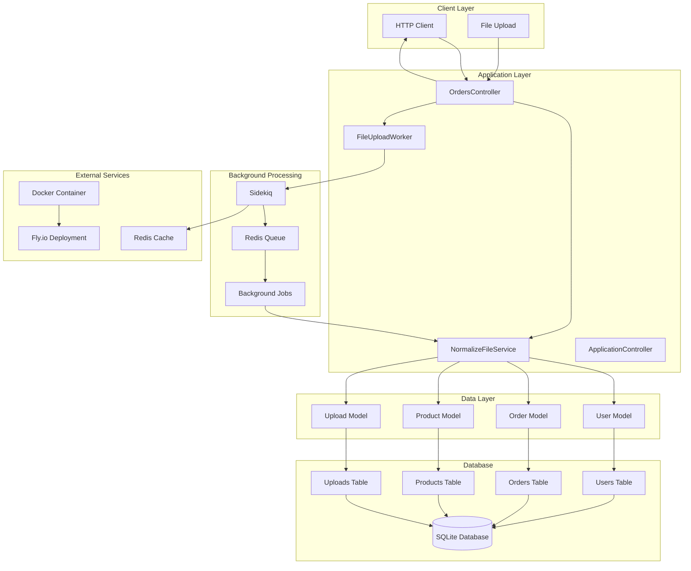
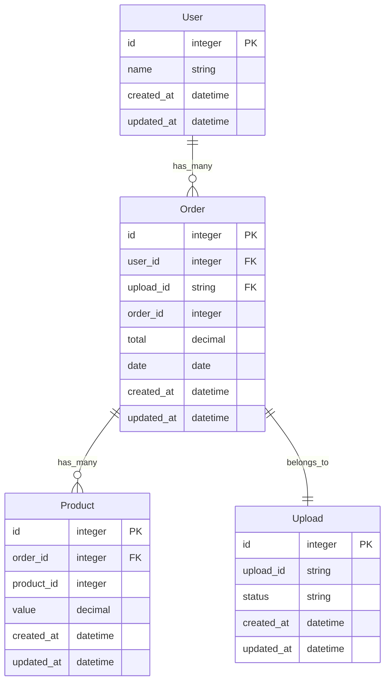
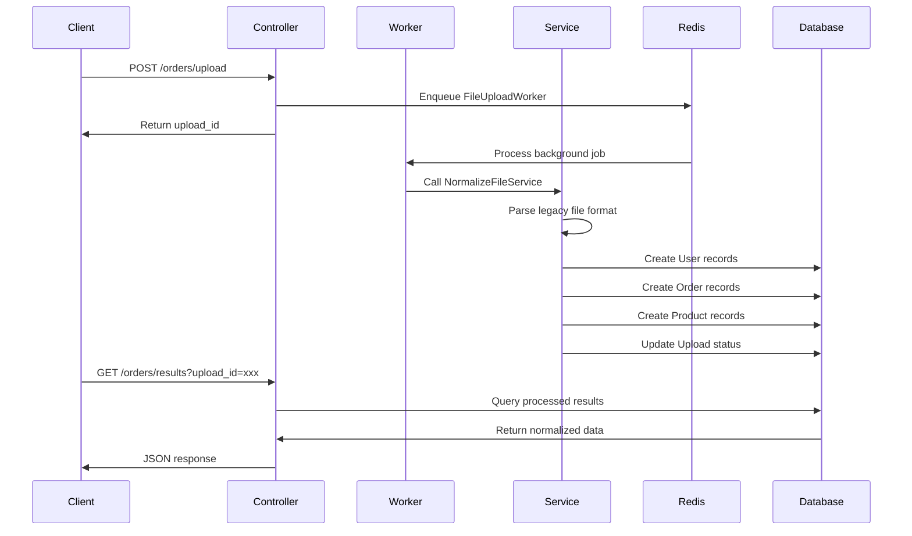
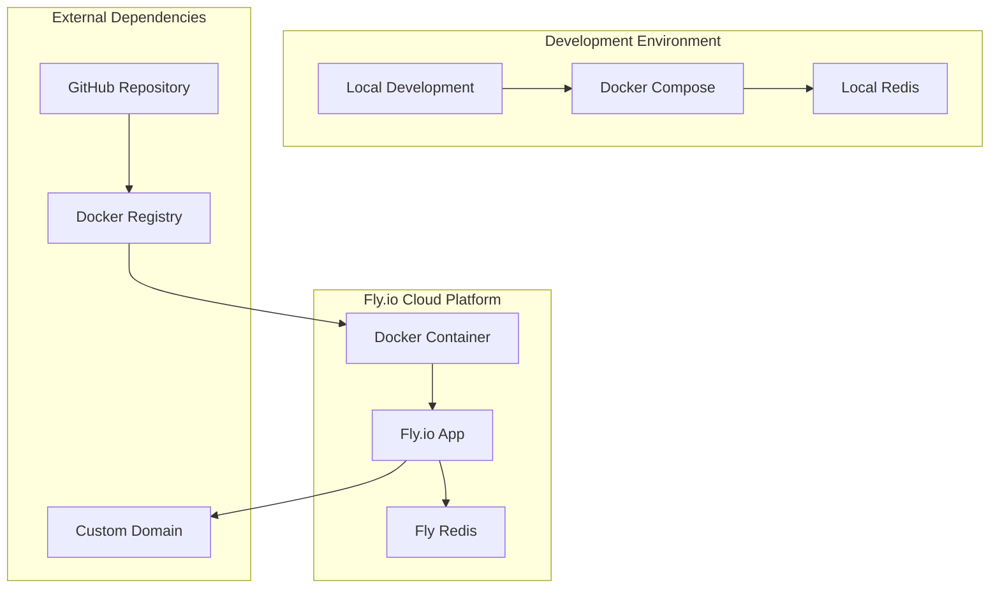
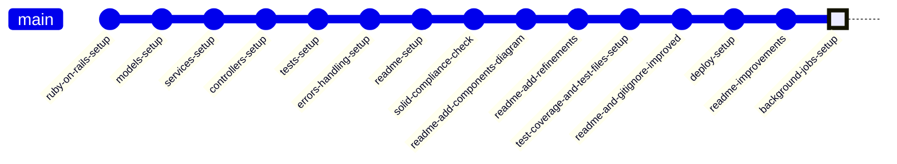

# **Project Order Normalizer API**

[Homepage](https://github.com/enogrob/order_normalizer_api)


## Contents

- [Summary](#summary)
- [Architecture](#architecture)
  - [Key Concepts](#key-concepts)
- [Tech Stack](#tech-stack)
- [Getting Started](#getting-started)
- [Usage Examples](#usage-examples)
- [Contributing Guidelines](#contributing-guidelines)
- [Troubleshooting](#troubleshooting)
- [License](#license)
- [References](#references)

## Summary

The Order Normalizer API is a Ruby on Rails REST API designed specifically for processing and normalizing legacy order data files. This project serves as a robust solution for transforming fixed-width legacy file formats into structured JSON data, making it invaluable for organizations dealing with data migration, legacy system integration, or order processing workflows.

The API provides asynchronous file processing capabilities using Sidekiq background jobs, ensuring that large files can be processed without blocking the main application thread. Users can upload legacy order files, receive immediate acknowledgment with tracking IDs, and retrieve processed results when ready. The system also offers comprehensive order querying functionality with filtering options for order IDs and purchase date ranges, all while maintaining strict adherence to SOLID design principles for maximum maintainability and scalability.

Built as a demonstration project for technical interviews (specifically for Luizalabs), this API showcases modern Ruby on Rails development practices, including comprehensive testing with RSpec, code coverage analysis with SimpleCov, background job processing, and cloud deployment capabilities via Fly.io with Docker containerization.

## Architecture



<details>
<summary><strong>1. Models Dependency Diagram - Rails Active Record Relationships</strong> (Click to expand)</summary>



</details>

<details>
<summary><strong>2. Background Job Processing Flow</strong> (Click to expand)</summary>



</details>

<details>
<summary><strong>3. Deployment Architecture</strong> (Click to expand)</summary>



</details>

<details>
<summary><strong>4. Git Development Flow</strong> (Click to expand)</summary>



</details>

### Key Concepts

* **Legacy File Processing**: The system processes fixed-width legacy data files containing order information with specific field positions and formats
* **Asynchronous Processing**: Background job processing using Sidekiq ensures large files don't block the main application thread
* **Data Normalization**: Converts proprietary legacy formats into standardized JSON structures with proper data types and relationships
* **SOLID Principles**: Architecture follows Single Responsibility, Open/Closed, Liskov Substitution, Interface Segregation, and Dependency Inversion principles
* **RESTful API Design**: Standard HTTP methods and status codes for predictable API interactions
* **Upload Tracking**: UUID-based tracking system for monitoring file processing status and retrieving results
* **Error Handling**: Comprehensive error handling for invalid files, parsing errors, and system failures
* **Data Relationships**: Proper Active Record associations between Users, Orders, and Products with referential integrity
* **Background Jobs**: Sidekiq workers handle file processing tasks to maintain application responsiveness
* **Code Coverage**: SimpleCov integration provides detailed test coverage analysis and reporting
* **Container Deployment**: Docker-based deployment strategy for consistent environments across development and production

## Tech Stack

* **Programming Language**: Ruby 3.3.6
* **Framework**: Rails 8.0.0 (latest stable version with modern features)
* **Database**: SQLite 3 (development), with Active Record ORM for data modeling
* **Background Processing**: Sidekiq 7.3.6 for asynchronous job processing
* **Caching**: Redis for job queues and session storage
* **Testing Framework**: RSpec 7.1 for behavior-driven testing with FactoryBot for test data
* **Code Coverage**: SimpleCov for test coverage analysis and reporting
* **API Documentation**: RESTful JSON APIs with structured error responses
* **Security**: Brakeman static analysis for security vulnerability scanning
* **Code Quality**: RuboCop Rails Omakase for consistent Ruby styling
* **Development Tools**: Debug gem for debugging, Web Console for development
* **Deployment**: Fly.io cloud platform with Docker containerization
* **CI/CD**: Kamal for deployment automation and container orchestration
* **Web Server**: Puma for high-performance request handling
* **Asset Management**: Rails 8 asset pipeline with modern JavaScript integration
* **Environment Management**: Rails credentials and environment-specific configurations

## Getting Started

### System Requirements

- Ruby 3.3.6 (managed via ASDF version manager)
- Node.js 23.2.0 for asset compilation
- Redis server for background job processing
- Git for version control
- Docker and Docker Compose for containerized deployment

### Installation

1. **Install ASDF Version Manager and Dependencies**
```bash
brew install asdf
echo ". /usr/local/opt/asdf/libexec/asdf.sh" >> $HOME/.zshrc
source $HOME/.zshrc
asdf plugin add ruby
asdf plugin add nodejs
asdf install ruby 3.3.6
asdf install nodejs 23.2.0
asdf global ruby 3.3.6
asdf global nodejs 23.2.0
gem install rails -v '8.0.0'
```

2. **Install Additional Tools**
```bash
# JSON processor for API testing
brew install jq

# Redis for background jobs
brew install redis
brew services start redis

# Docker for deployment
brew install --cask docker

# Fly.io CLI for cloud deployment
brew install flyctl
```

3. **Clone and Setup Project**
```bash
git clone git@github.com:enogrob/order_normalizer_api.git
cd order_normalizer_api
bundle install
rails db:migrate
```

4. **Verify Installation**
```bash
# Run test suite to ensure everything works
bundle exec rspec

# Check test coverage
open coverage/index.html
```

5. **Start Development Environment**
```bash
# Terminal 1: Start Rails server
bin/dev

# Terminal 2: Start Sidekiq for background jobs
bundle exec sidekiq
```

The application will be available at `http://localhost:3000` with background job processing enabled.

## Usage Examples

### File Upload and Processing

**Upload a legacy order file for processing:**
```bash
# Set API endpoint (local development)
export HOST_API=http://localhost:3000

# Upload a valid order file
curl -X POST -F "file=@data_1.txt" $HOST_API/orders/upload | jq '.'
```

**Response:**
```json
{
  "message": "File processing started",
  "upload_id": "24ceccff-860e-4e89-8c18-9237b287aba7"
}
```

**Handle file processing errors:**
```bash
# Upload invalid file format
curl -X POST -F "file=@data_invalid.txt" $HOST_API/orders/upload | jq '.'
```

**Error Response:**
```json
{
  "error": "Error parsing line: 1234567890John Doe... Error: invalid date"
}
```

### Retrieve Processing Results

**Get processed order data using upload ID:**
```bash
curl -X GET "$HOST_API/orders/results?upload_id=24ceccff-860e-4e89-8c18-9237b287aba7" | jq '.'
```

**Successful Response:**
```json
[
  {
    "user_id": 62,
    "name": "Jonah Satterfield",
    "orders": [
      {
        "order_id": 673,
        "total": "851.01",
        "date": "2021-08-29",
        "products": [
          {
            "product_id": 3,
            "value": 851.01
          }
        ]
      }
    ]
  }
]
```

### Query Orders with Filters

**Filter orders by specific order ID:**
```bash
curl "$HOST_API/orders?id=628" | jq '.'
```

**Filter orders by date range:**
```bash
curl "$HOST_API/orders?start_date=2021-01-01&end_date=2021-12-31" | jq '.'
```

**Response Example:**
```json
[
  {
    "order_id": 628,
    "total": "4132.24",
    "date": "2021-03-08",
    "products": [
      {
        "product_id": 4,
        "value": "1396.87"
      },
      {
        "product_id": 3,
        "value": "1940.89"
      }
    ]
  }
]
```

### Production Deployment Usage

**For deployed application on Fly.io:**
```bash
# Set production API endpoint
export HOST_API=https://order-normalizer-api.fly.dev

# Use same curl commands as above with production endpoint
curl -X POST -F "file=@data_1.txt" $HOST_API/orders/upload | jq '.'
```

## Contributing Guidelines

This project follows standard Ruby on Rails development practices and welcomes contributions that maintain code quality and architectural integrity.

### Development Workflow

1. **Fork the repository** and create a feature branch from `main`
2. **Set up your development environment** following the Getting Started guide
3. **Write tests first** using RSpec for any new functionality
4. **Implement features** following SOLID principles and Rails conventions
5. **Ensure test coverage** remains above 75% using SimpleCov
6. **Run the full test suite** with `bundle exec rspec` before submitting
7. **Check code style** with RuboCop: `bundle exec rubocop`
8. **Submit a pull request** with clear description of changes

### Coding Standards

* **Ruby Style**: Follow RuboCop Rails Omakase configuration
* **Testing**: Maintain comprehensive RSpec test coverage
* **Documentation**: Update README for any API changes
* **Security**: Run Brakeman scan for security vulnerabilities
* **Performance**: Consider impact on background job processing

### Areas for Contribution

* **Enhanced error handling** for edge cases in file processing
* **Additional file format support** beyond the current legacy format
* **Performance optimizations** for large file processing
* **API versioning** for backward compatibility
* **Enhanced logging and monitoring** capabilities
* **Database optimization** for large-scale deployments

## Troubleshooting

### Common Issues and Solutions

**Q: Sidekiq jobs are not processing**
A: Ensure Redis is running (`brew services start redis`) and Sidekiq worker is started (`bundle exec sidekiq`)

**Q: File upload returns "invalid file format" error**
A: Verify the file follows the expected fixed-width format. Check sample files (`data_1.txt`, `data_2.txt`) for reference format

**Q: Test coverage reports are not generated**
A: Ensure SimpleCov is properly configured and run tests with `bundle exec rspec`. Open `coverage/index.html` to view results

**Q: Docker deployment fails**
A: Verify Docker is running and Dockerfile is properly configured. Check Fly.io deployment logs with `fly logs`

**Q: Database migration errors**
A: Run `rails db:migrate` to ensure all migrations are applied. For production, use `fly ssh console -C '/rails/bin/rails db:migrate'`

### Getting Help

* **Check test output** for specific error messages and stack traces
* **Review application logs** in `log/development.log` for detailed error information
* **Use Fly.io logs** (`fly logs`) for production deployment issues
* **Verify Redis connection** with `redis-cli ping` for background job issues

## License

This project is developed as a demonstration application for technical interviews and learning purposes. The code is available for educational and reference use.

## References

* [Order Normalizer API GitHub Repository](https://github.com/enogrob/order_normalizer_api) - Official source code and project documentation
* [Ruby on Rails 8.0 Guides](https://guides.rubyonrails.org/) - Comprehensive Rails framework documentation and best practices
* [Sidekiq Background Jobs](https://sidekiq.org/) - Background job processing library documentation and configuration guides
* [RSpec Testing Framework](https://rspec.info/) - Behavior-driven development testing framework for Ruby applications
* [SimpleCov Code Coverage](https://github.com/simplecov-ruby/simplecov) - Code coverage analysis tool for Ruby with comprehensive reporting
* [Fly.io Deployment Platform](https://fly.io/docs/) - Cloud deployment platform documentation for Rails applications
* [Docker Containerization](https://docs.docker.com/) - Container platform documentation for application deployment
* [Redis In-Memory Database](https://redis.io/docs/) - In-memory data structure store used for job queues and caching
* [Brakeman Security Scanner](https://brakemanscanner.org/) - Static analysis security vulnerability scanner for Rails applications
* [RuboCop Code Style](https://rubocop.org/) - Ruby static code analyzer and formatter for consistent code style
* [ASDF Version Manager](https://asdf-vm.com/) - Extensible version manager for multiple programming languages
* [Luizalabs Career Opportunities](https://www.linkedin.com/company/luizalabs/posts/?feedView=all) - Target company for demonstration project development

